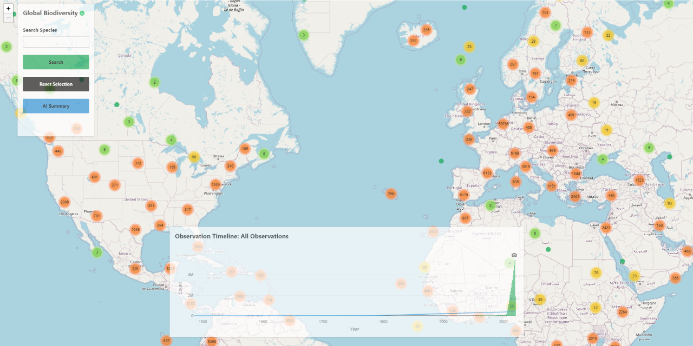

# Biodiversity observations: Shiny app for species mapping and timeline analysis
This Shiny application visualizes biodiversity observations from the Global Biodiversity Information Facility (GBIF). Users can explore species occurrences on an interactive map and view the timeline of observations over the years. The app provides features such as species search by vernacular and scientific names, detailed observation popups, and a timeline of species sightings. The app includes an AI-powered summary feature that generates informative overviews and fun facts about displayed species data.

Try the live demo of the application here: [Live Demo](https://pmarcowski.shinyapps.io/global-biodiversity/).

## Features
- **Interactive map**: Visualize species observations across the world with detailed popups including images and observation dates.
- **Default view**: Display all species observations for the initial view.
- **Species search**: Search for species by vernacular or scientific names and filter the observations on the map accordingly.
- **Observation timeline**: View a bar chart showing the frequency of species observations over time.
- **AI Summary**: Generate informative overviews and fun facts about currently displayed species or global biodiversity data.

## Usage
The Shiny application serves as the interface for exploring biodiversity data, allowing users to:
- Enter a species name in the search box to find matching species.
- Select a species from the list to view its occurrences on the map and timeline.
- Click the "Show all species" button to reset the view and display all species observations.
- Click the "AI Summary" button to generate an overview and interesting fact about the currently displayed data.

## Installation
To run this application locally, follow these steps:
1. Ensure R is installed with the necessary packages.
2. Clone this repository or download the necessary files.
3. Open the *app.R* file in RStudio or another R environment.
4. Run the *app.R* script or execute the `shiny::runApp()` command in the R console.

## Feedback and questions
If you have any feedback, suggestions, or questions regarding this application, please feel free to open an issue on the GitHub repository or contact the author directly.

## Environment Variables
This application uses the following environment variables:

- `OPENROUTER_API_KEY`: Your OpenRouter API key (required for the AI Summary feature)
- `OPENROUTER_MODEL`: The AI model to use (defaults to "openai/o3-mini")
- `OPENROUTER_TOKEN_LIMIT`: Maximum tokens for AI responses (defaults to 500)

## License
This project is licensed under the GPL-3.0 License - see the [LICENSE](LICENSE) file for details.

## Acknowledgments
This app uses data from the Global Biodiversity Information Facility (GBIF). The data is available here: [GBIF](https://www.gbif.org/occurrence/search?dataset_key=8a863029-f435-446a-821e-275f4f641165).
